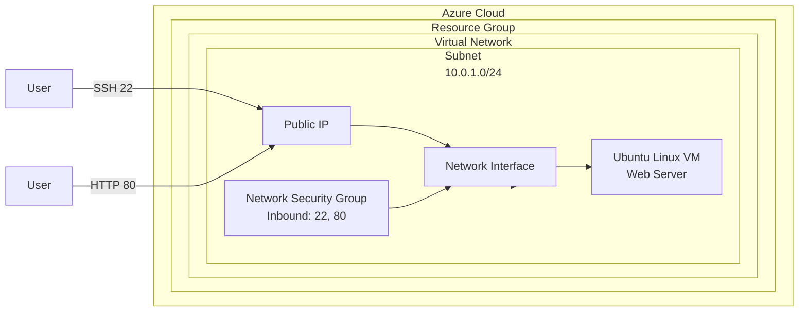

# Architecture Diagram

```mermaid
flowchart LR
    user1[User]
    user2[User]

    subgraph azure[Azure Cloud]
        subgraph rg[Resource Group]
            subgraph vnet[Virtual Network\n10.0.0.0/16]
                subgraph subnet[Subnet\n10.0.1.0/24]
                    pip[Public IP]
                    nsg[Network Security Group\nInbound: 22, 80]
                    nic[Network Interface]
                    vm[Ubuntu Linux VM\nWeb Server]
                end
            end
        end
    end

    user1 -->|SSH 22| pip
    user2 -->|HTTP 80| pip
    pip --> nic
    subnet --> nic
    nsg --> nic
    nic --> vm
```
